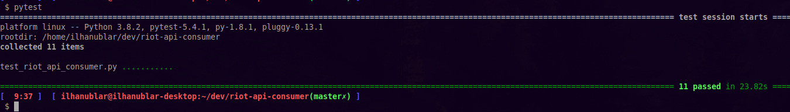

# riot-api-consumer
A simple Consumer of Riot Games API. Focused on TFT game mode(for now).

 

### Functions description:

| Functions/Methods                  | Description                                                           | Parameters
|------------------------------------|-----------------------------------------------------------------------|------------------------
| get_summoner_profile               | You can get the profile information of a summoner                     |
| get_matches_by_summoner            | You can get the code of lastest matches of a summoner                 | Quantity Matches(Int)
| get_match_by_match_id              | You can get the details of match, by code match                       | Code Match(String)
| get_challenger_league              | You can get the list of all challengers players                       |
| get_grandmaster_league             | You can get the list of all grandmaster players                       |
| get_master_profile                 | You can get the list of all master players                            |
| get_player_ranked_status           | You can get the details about ranking status of a player              |
| get_leagues_by_ranking             | You can get a list of leagues, filtred by tir and tier and division   |tier='DIAMOND', division='I' (Example)
| get_league_details_by_league_id    | You can get details about a specific league                           |

#### Obs.: Work in Progress.

### Objectives: 

For understand more about Riot Api access this link:
https://developer.riotgames.com/
For now, the focus is simplify the use of endpoints of this categories:
TFT-LEAGUE-V1
TFT-MATCH-V1
TFT-SUMMONER-V1

 

### Tests(With Pytest):

Actually, i run the tests automa

 

I am currently running the tests automatically on TravisCI every push, if everyone passing the badge has the status "Build Passing", as below:

